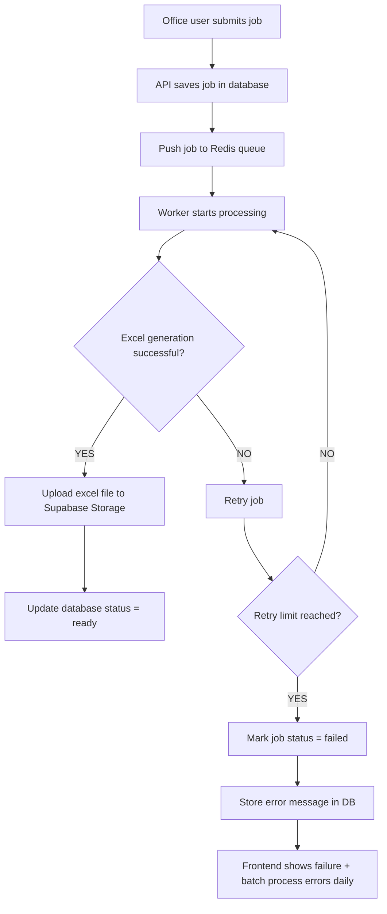

# Work Order Automation Platform

## Overview

A full-stack app where office users submit job details via a form. The backend
processes the request asynchronously and generates a downloadable Excel job
sheet. A field user retrieves the job sheet, performs the work, and marks the
job as completed in the system.

---

## Tech Stack

**Frontend**

- React
- TanStack Router + TanStack Query
- TypeScript
- Tailwind CSS

**Backend**

- Node.js + Fastify
- Prisma ORM + Supabase (Postgres + Auth/API)

**Database**

- Supabase Postgres

**Queue / Background Processing**

- Redis + BullMQ

**Excel Generation**

- ExcelJS

**File Storage**

- Supabase Storage (Excel files)

**Deployment**

- Render (Node API + Worker)

## System Flow



## Core Features

### Office User Workflow

Form collects:

- Customer name
- Address
- Job type
- Description

Creates job and queues Excel generation.

### Background Worker

Separate worker:

1. Reads job from queue
2. Loads job data from Supabase Postgres via Prisma
3. Generates Excel sheet
4. Uploads Excel file to Supabase Storage and saves file location
5. Updates job status to pending | processing | ready | failed

### Field User Workflow

Field users can:

1. View list of jobs with status = `ready`
2. Download Excel job sheet
3. Perform the job in real life
4. Mark job as completed via:

`PATCH /jobs/:id/complete`

### Track Job Status

Frontend:

1. Submit form
2. Receive job ID
3. Poll:

`GET /jobs/:id`

4. Show:

- Processing indicator
- Download button when `ready`
- Completed badge when finished

---

## Minimal Database Shape

**jobs**

```
id
customer_name
job_address
job_type
description
job_sheet_status            // pending | processing | ready | failed
job_status                  // new | assigned | in_progress | completed
file_url                    // Supabase Storage object path/key
created_at
completed_at
assigned_field_user_id
notes_from_field
created_by_user_id
updated_at
```

Use Supabase Row Level Security (RLS) so office users can create/view their
jobs, and field users can only read/update jobs assigned to them.

## Tasks

1. Create project repos/folders for client and server
2. Set up Render services early (Node API web service + Node worker service)
3. Create separate environments: `test` and `production`
4. Add environment variables for each environment (Supabase, Redis, app URLs)
5. Configure Render auto-deploy so pushes/merges to `main` trigger deployments
6. Bootstrap Node server with Fastify (`/health` route + env loading)
7. Bootstrap React app with routing, API client, and basic pages
8. Set up Prisma schema for `jobs` and run first migration on test DB
9. Configure Supabase Auth, RLS, and storage bucket for Excel files
10. Integrate Prisma client into API and worker services
11. Build `POST /jobs` endpoint (create job + enqueue Redis job)
12. Build `GET /jobs/:id` and `GET /jobs` endpoints for status/listing
13. Build background worker with BullMQ + ExcelJS generation flow
14. Build `GET /jobs/:id/download` endpoint with signed URL response
15. Build `PATCH /jobs/:id/complete` and `POST /jobs/:id/retry-sheet`
16. Build React job submit form and connect to `POST /jobs`
17. Build status polling UI and download action in React
18. Build field-user list view with complete action
19. Add automated tests (unit + API integration) in test environment
20. Add logging, retry/backoff, and failure monitoring for queue/worker
21. Run full end-to-end checks in test environment (Render test services)
22. Promote to production and verify post-deploy smoke checks on Render

## API Routes Needed

### 1) Create Job

`POST /jobs`

Creates a new job record and pushes a queue job for Excel generation.

**Request body**

```json
{
  "customer_name": "Jane Doe",
  "job_address": "1 High Street",
  "job_type": "Install",
  "description": "Install new unit"
}
```

**Response (201)**

```json
{
  "id": "5fd7d9a3-9f0f-4cb2-a884-89b9c2b6391e",
  "job_sheet_status": "pending",
  "job_status": "new"
}
```

### 2) Get Job by ID (for polling)

`GET /jobs/:id`

Returns a single job with current statuses and file URL (when ready).

**Response (200)**

```json
{
  "id": "5fd7d9a3-9f0f-4cb2-a884-89b9c2b6391e",
  "job_sheet_status": "processing",
  "job_status": "new",
  "file_url": null
}
```

### 3) List Jobs

`GET /jobs`

Returns a filterable list of jobs for office/field views.

**Query params (suggested)**

- `job_sheet_status` (pending | processing | ready | failed)
- `job_status` (new | assigned | in_progress | completed)
- `assigned_field_user_id`

### 4) Download Job Sheet

`GET /jobs/:id/download`

Returns a signed URL (from Supabase Storage) or redirects to the stored Excel
file.

**Response (200)**

```json
{
  "download_url": "https://...",
  "expires_in": 300
}
```

### 5) Mark Job Complete

`PATCH /jobs/:id/complete`

Marks the field work as complete.

**Request body (optional)**

```json
{
  "notes_from_field": "Work completed and tested"
}
```

**Response (200)**

```json
{
  "id": "5fd7d9a3-9f0f-4cb2-a884-89b9c2b6391e",
  "job_status": "completed",
  "completed_at": "2026-02-21T14:30:00.000Z"
}
```

### 6) Retry Failed Excel Generation

`POST /jobs/:id/retry-sheet`

Re-queues Excel generation when `job_sheet_status = failed`.

**Response (202)**

```json
{
  "id": "5fd7d9a3-9f0f-4cb2-a884-89b9c2b6391e",
  "job_sheet_status": "pending"
}
```

### Common Error Responses

- `400` invalid input
- `401` unauthenticated
- `403` forbidden by role/RLS policy
- `404` job not found
- `409` invalid state transition
- `500` server/worker error

## Project Goals

- Async backend workflows
- Prisma + Supabase architecture
- Supabase + Redis integration
- Queue-based architecture
- Worker separation
- Document generation pipeline
- Multi-role workflow (office → field user)
- Production-style full-stack design
